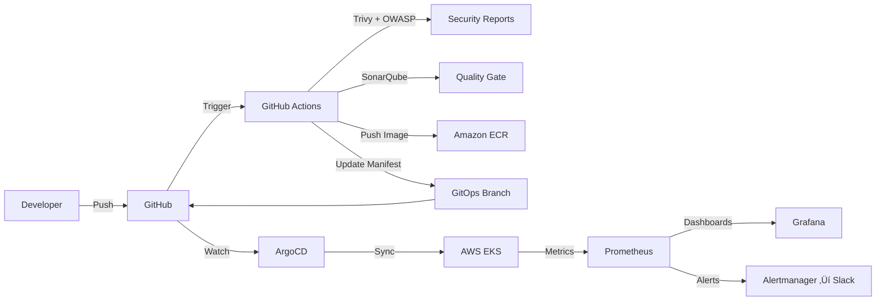
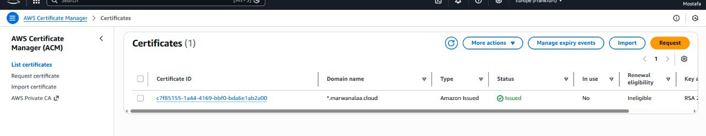
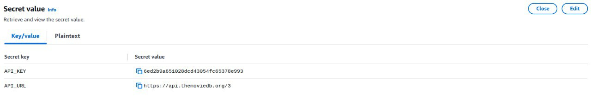

<p align="center">
  
</p>

<h1 align="center">
  
</h1>

<h3 align="center" style="color: #64B5F6;">
  Ìæì DevOps Graduation Project ‚Äî National Telecommunication Institute (NTI)
</h3>

<p align="center">
  
  
  
  
  
  
</p>

<p align="center">
  
  
  
  
  
  
  
</p>

<p align="center" style="font-size: 1.12rem; line-height: 1.8; max-width: 900px; margin: 20px auto;">
  Ìæ¨ A complete <strong>DevSecOps + GitOps</strong> implementation for a Netflix-clone application on <strong>AWS EKS</strong>. <br/>
  ‚úÖ Every code change triggers <strong>Build ‚Üí Scan ‚Üí Push ‚Üí GitOps Update ‚Üí ArgoCD Sync ‚Üí Deploy</strong>. <br/>
  Ì≥à Full observability with <strong>Prometheus + Grafana</strong> and alerting via <strong>Alertmanager ‚Üí Slack</strong>.
</p>

---

## Ì∫Ä Project Summary

**End-to-End Netflix Clone DevOps Project | AWS, Kubernetes, Terraform, GitHub Actions, ArgoCD, Prometheus, Grafana**

- Built a production-ready DevSecOps pipeline for a Netflix-style app deployed on AWS EKS.
- Provisioned infrastructure using Terraform (VPC, Subnets, NAT/IGW, EKS, Node Groups).
- Integrated AWS Cognito for authentication.
- Automated CI with GitHub Actions: SonarQube, Trivy, OWASP Dependency-Check, image build/tag/push.
- Implemented GitOps CD using ArgoCD + ALB Ingress + TLS (ACM) + Route 53.
- Enabled autoscaling using HPA + Cluster Autoscaler.
- Enabled observability + alerting with Prometheus, Grafana, Alertmanager + Slack notifications.

---

## Ì≥ê Architecture Overview

<div align="center">
  
</div>

---

## Ì¥• CI/CD + GitOps Flow


---

## Ì∑± Evidence Screenshots

### ‚úÖ Terraform Apply
<div align="center">
  
</div>

### ‚úÖ Kubernetes: Namespaces
<div align="center">
  
</div>

### ‚úÖ Kubernetes: Nodes
<div align="center">
  
</div>

### ‚úÖ GitOps / ArgoCD UI
<div align="center">
  
</div>

### ‚úÖ Netflix Namespace Workloads + HPA
<div align="center">
  
</div>

### ‚úÖ Cluster Autoscaler (kube-system)
<div align="center">
  
</div>

### ‚úÖ External Secrets (namespace: external-secrets)
<div align="center">
  
</div>

### ‚úÖ ACM Certificate (TLS)
<div align="center">
  
</div>

### ‚úÖ Website Running
<div align="center">
  
</div>

---

## Ì¥ê Secrets & Security Notes

⚠️ Do not commit secrets. Use GitHub Secrets / External Secrets.

<div align="center">
  
</div>

---

## Ì∑∞ Repo Structure (Key Paths)
```
.github/workflows/devsecops-full-pipeline.yml   # Full pipeline workflow
Source-Code/Application-Code/                  # App source code
Kubernetes/                                    # K8s manifests
terraform/                                     # Terraform IaC
images/                                        # README images
```

---

## ⭐ Contact

**Name:** Sohila Hosam  
**GitHub:** https://github.com/sohila12

<div align="center">
  
  
</div>
