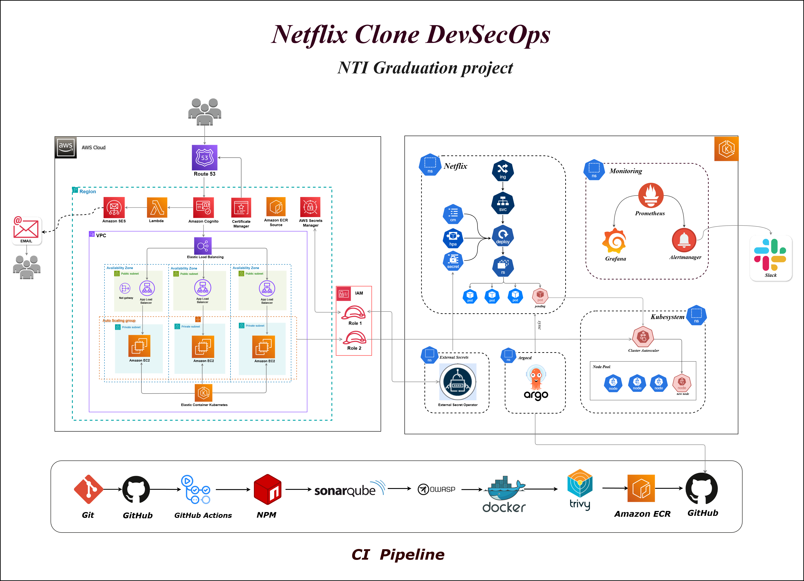
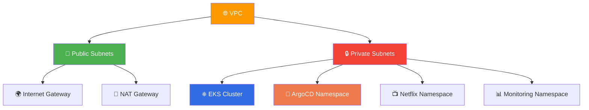
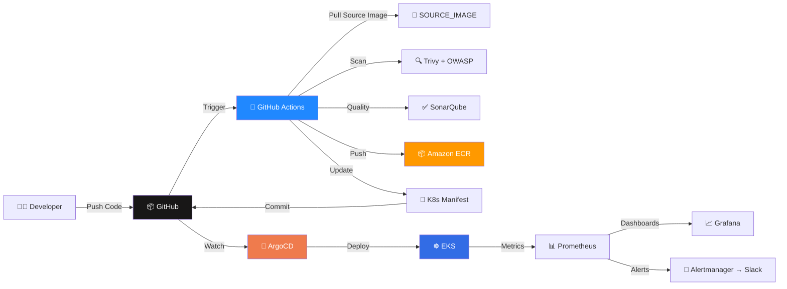
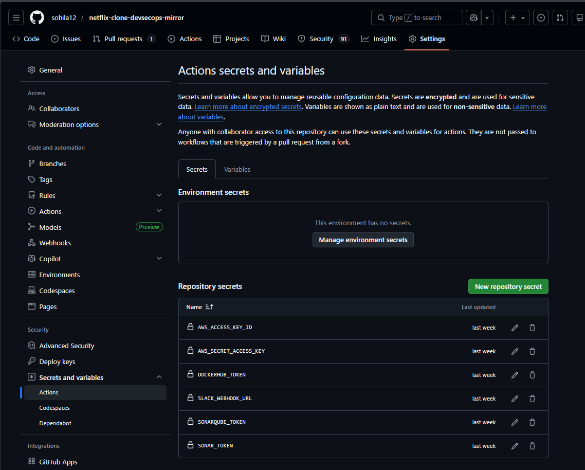
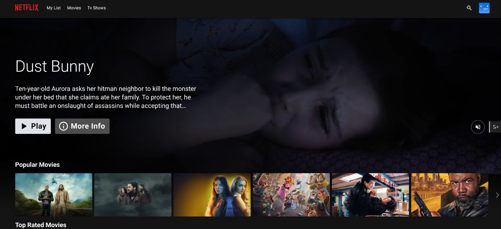

<p align="center">
  
</p>

<h1 align="center">
  
</h1>

<h3 align="center">
 🎓 DevOps Graduation Project — <strong>National Telecommunication Institute (NTI)</strong>
</h3>

<p align="center">
  
  
  
  
  
  
</p>

<p align="center">
  
  
  
  
  
  
  
</p>

<p align="center" style="font-size: 1.15rem; line-height: 1.8; max-width: 900px; margin: 20px auto;">
  🎓 This project represents the <strong>culmination of DevOps training</strong> at the <br/>
  <strong>National Telecommunication Institute (NTI)</strong>. <br/>
  ✨ A complete production-ready <strong>DevSecOps + GitOps</strong> pipeline demonstrating modern cloud-native practices.
</p>

---

<div align="center">

## 🚀 **ArgoCD GitOps Deployment on AWS EKS**
### *Using GitHub Actions & Amazon ECR*

</div>

<table align="center">
<tr>
<td align="center" width="33%">

### 🏗️ **Infrastructure**

- ✅ AWS VPC (Public/Private Subnets)
- ✅ EKS Cluster + Node Groups
- ✅ NAT Gateway + Internet Gateway
- ✅ ALB Ingress Controller
- ✅ Route 53 + ACM (TLS)
- ✅ Cluster Autoscaler

</td>
<td align="center" width="33%">

### ⚙️ **CI/CD Pipeline**

- ✅ GitHub Actions
- ✅ Docker Tag & Push (ECR)
- ✅ Trivy (Vuln + Secrets)
- ✅ OWASP Dependency-Check
- ✅ SonarQube (Self-Hosted)
- ✅ Reports → Artifacts + S3

</td>
<td align="center" width="33%">

### 🔄 **GitOps**

- ✅ Manifest Auto-Update
- ✅ GitOps Branch per Run
- ✅ ArgoCD Auto-Sync
- ✅ Auto-healing + Prune
- ✅ Rollback Ready

</td>
</tr>
</table>

---

## 📐 Architecture Overview

<div align="center">



</div>

### 🏛️ **Components Breakdown**

<table>
<tr>
<td width="50%">

#### 🌐 **Network Layer**


**Public Subnets:**
- Internet Gateway
- NAT Gateway
- ALB / Ingress

**Private Subnets:**
- EKS Worker Nodes
- ArgoCD Controller
- Application Pods
- Monitoring Stack

</td>
<td width="50%">

#### 🔄 **CI/CD Flow**


**Automation Flow:**
- Code Push → GitHub
- Actions → Scan + Quality + Push to ECR
- Actions → Update Manifests (GitOps branch)
- ArgoCD → Auto-Sync → Deploy to EKS
- Prometheus/Grafana → Dashboards + Alerts to Slack

</td>
</tr>
</table>

---

#### 🔄 **CI/CD Flow**

**Automation Flow:**
1. Code Push → GitHub
2. Actions → Scan + Quality + Push to ECR
3. Actions → Update Manifests (GitOps branch)
4. ArgoCD → Auto-Sync → Deploy to EKS
5. Prometheus/Grafana → Dashboards + Alerts to Slack

</td>
</tr>
</table>

---

## 🔥 CI/CD Workflow Pipeline

<div align="center">

```
┌──────────────────────────────────────────────────────────────────────────────┐
│                         🚀 AUTOMATED DEPLOYMENT PIPELINE                      │
└──────────────────────────────────────────────────────────────────────────────┘
```

</div>

### 📝 Step-by-Step Workflow

<table>
<tr>
<td width="10%" align="center"><h3>1️⃣</h3></td>
<td width="90%">

**👨‍💻 Developer Push**
```bash
git add .
git commit -m "feat: update application"
git push origin main
```

**Triggers:** GitHub Actions workflow on main branch

</td>
</tr>

<tr>
<td width="10%" align="center"><h3>2️⃣</h3></td>
<td width="90%">

**🤖 GitHub Actions Pipeline**

Pipeline Steps:
```
| Step | Action | Tool |
|:----:|--------|------|
| 🔁 | Pull SOURCE_IMAGE | Docker |
| 🏷️ | Tag Image for ECR | AWS CLI |
| 🔍 | Security Scan | Trivy |
| 🧪 | Dependency Check | OWASP |
| ✅ | Code Quality | SonarQube |
| 📤 | Push to Registry | ECR |
| 💾 | Upload Reports | S3 + Artifacts |
| 📝 | Update Manifest | Git |
| 🔀 | Create GitOps Branch | GitHub |
```

**📊 Output:** New ECR image tagged with commit SHA

</td>
</tr>

<tr>
<td width="10%" align="center"><h3>3️⃣</h3></td>
<td width="90%">

**🔄 ArgoCD GitOps Sync**
```
🔍 ArgoCD Detects Changes
        ↓
📊 Compares State
        ↓
🔄 Auto-Sync Enabled
        ↓
🚀 Deploys to Amazon EKS
        ↓
✅ Application Updated Successfully
```

**🎯 Result:** Zero-downtime deployment with automatic rollback capability

</td>
</tr>
</table>

---

## 📸 Implementation Evidence

<div align="center">

### 🛠️ Step-by-Step Setup Guide (with Evidence)

</div>

### 🏗️ Step 1: Infrastructure Provisioning with Terraform
```bash
cd terraform
terraform init
terraform plan
terraform apply -auto-approve
```

<p align="center">
  
</p>

⚠️ **Important:** Configure AWS credentials before running Terraform.

**🎯 What Gets Created:**
- ✅ VPC with public/private subnets
- ✅ Internet Gateway & NAT Gateway
- ✅ EKS Cluster with managed node groups
- ✅ Security groups & IAM roles
- ✅ Load Balancer infrastructure

---

## ⚙️ Step 2: Configure Kubectl for EKS
```bash
aws eks update-kubeconfig --name my-eks --region eu-central-1

kubectl get nodes
kubectl cluster-info
kubectl get ns -A
```

<p align="center">
  
  
</p>

**✅ Verification Checklist:**
- ✓ Nodes are in Ready state
- ✓ Cluster endpoint is reachable
- ✓ Current context is set to my-eks

---

## 🐳 Step 3: Build & Test Docker Image (Local)
```bash
# Go to application directory
cd Source-Code/Application-Code

# Build Docker image locally
docker build -t netflix-clone:local .

# Run container locally
docker run -d --name netflix-clone-local -p 8080:80 netflix-clone:local

# Verify application
curl http://localhost:8080
```

**🔍 Testing:**
- ✅ Docker image builds successfully
- ✅ Container starts without errors
- ✅ Application responds on expected port
```bash
# Cleanup
docker rm -f netflix-clone-local
```
---
## 🔐 Step 4: User Authentication (Amazon Cognito)

Amazon Cognito is used to handle user authentication for the application.
It provides secure Sign Up and Sign In functionality using a managed User Pool.

### 👤 User Sign In
<p align="center">
  
</p>

### 🆕 User Sign Up
<p align="center">
  
</p>

---
## 📦 Step 5: Push Docker Image to Amazon ECR

### 1️⃣ Authenticate Docker to Amazon ECR
```bash
aws ecr get-login-password --region eu-central-1 \
| docker login --username AWS --password-stdin 734468801857.dkr.ecr.eu-central-1.amazonaws.com
```

### 2️⃣ Tag Image for ECR
```bash
docker tag netflix-clone:local \
734468801857.dkr.ecr.eu-central-1.amazonaws.com/nti_project:latest
```

### 3️⃣ Push Image to Amazon ECR
```bash
docker push 734468801857.dkr.ecr.eu-central-1.amazonaws.com/nti_project:latest
```

**✅ Result:**
- Image successfully stored in Amazon ECR
- Ready to be used by Kubernetes & CI/CD pipeline

---
## 🔄 Step 6: CI/CD + GitOps Automation (GitHub Actions → ArgoCD)

Once the Docker image is available in Amazon ECR, the CI/CD pipeline automatically performs security scans, tags and pushes the image, updates Kubernetes manifests, and triggers ArgoCD to sync and deploy the application to the EKS cluster.
```
Scan → Tag → Push → Update Manifest → ArgoCD Sync → Deploy
```
### 🔁 Pipeline Responsibilities

| Step | Action | Tool |
|:----:|--------|------|
| 🔍 | Trivy Scan (vulnerabilities + secrets) | Trivy |
| 🧪 | OWASP Dependency Check | OWASP |
| ✅ | Code Quality Analysis | SonarQube |
| 📦 | Push New Tagged Images | Amazon ECR |
| 📝 | Update Kubernetes Manifest | Git |
| 🔄 | Trigger Auto-Sync | ArgoCD |
| ☸️ | Deploy to EKS (my-eks) | Kubernetes |

---

## 🔄 Step 7: Install & Configure ArgoCD
```bash
kubectl create namespace argocd

kubectl apply -n argocd \
  -f https://raw.githubusercontent.com/argoproj/argo-cd/stable/manifests/install.yaml

kubectl wait --for=condition=available deployment/argocd-server \
  -n argocd --timeout=300s

kubectl -n argocd get secret argocd-initial-admin-secret \
  -o jsonpath="{.data.password}" | base64 -d

kubectl port-forward svc/argocd-server -n argocd 8080:443
```

## 🔐 Step 8: Configure GitHub Secrets

**Repository → Settings → Secrets and variables → Actions**

| Secret | Purpose |
|--------|---------|
| `AWS_ACCESS_KEY_ID` | AWS Authentication |
| `AWS_SECRET_ACCESS_KEY` | AWS Authentication |
| `SONARQUBE_TOKEN` | SonarQube Scan |
| `SLACK_WEBHOOK_URL` | Alerts (optional) |

<p align="center">
  
</p>

---
## 📦 Step 9: Create ArgoCD Application
```bash
kubectl apply -f argocd/application.yaml
```
```yaml
apiVersion: argoproj.io/v1alpha1
kind: Application
metadata:
  name: netflix
  namespace: argocd
spec:
  project: default
  source:
    repoURL: https://github.com/sohila12/netflix-clone-devsecops-mirror
    targetRevision: main
    path: Kubernetes
  destination:
    server: https://kubernetes.default.svc
    namespace: netflix
  syncPolicy:
    automated:
      prune: true
      selfHeal: true
```
<p align="center">
  
</p>

**✅ Result:**
- ArgoCD starts monitoring the repository
- Any change to Kubernetes manifests is automatically applied to the cluster

---
## 🔄 Step 10: Trigger Auto Deployment

Any change pushed to the `main` branch automatically triggers the CI/CD pipeline.
```bash
echo "trigger pipeline" >> README.md
git add README.md
git commit -m "chore: trigger deployment"
git push origin main
```
### 🔁 Pipeline Flow
```
CI → Scan → Push to ECR → Update Manifest → ArgoCD Sync → Deploy
```

**What Happens Next:**

| Step | Action | Tool |
|:----:|--------|------|
| 🤖 | GitHub Actions workflow starts | GitHub Actions |
| 🔍 | Docker image scanned | Trivy |
| 🧪 | Dependency analysis | OWASP |
| ✅ | Code quality analysis | SonarQube |
| 📦 | Image tagged and pushed | Amazon ECR |
| 📝 | Manifest updated in GitOps branch | Git |
| 🔄 | ArgoCD detects change and syncs | ArgoCD |
| ☸️ | Application deployed to EKS | Kubernetes |

---

## 📊 Step 11: Verify Deployment

After ArgoCD sync completes, verify that the application is running correctly.
```bash
kubectl get all -n netflix
kubectl get hpa -n netflix
```

**Expected Result:**
- ✅ Pods are in `Running` state
- ✅ Deployment and ReplicaSets are healthy
- ✅ HPA is enabled and monitoring CPU utilization

---

## 🚀 Step 12: Verify Cluster Autoscaler

Ensure that Cluster Autoscaler is running and managing node scaling.
```bash
kubectl get all -A | grep cluster-autoscaler
```

<p align="center">
  
</p>

### External Secrets

<p align="center">
  
</p>

**Expected Result:**
- ✅ Cluster Autoscaler pod is running in `kube-system` namespace
- ✅ Node scaling is handled automatically based on workload demand

---
## 🔑 Step 13: Verify External Secrets

External Secrets is used to securely inject sensitive values from AWS services instead of hardcoding them.
```bash
kubectl get all -n external-secrets
```

**Expected Result:**
- ✅ External Secrets controller pods are running
- ✅ Secrets are synchronized into application namespaces

---

## 🔐 Step 14: Verify TLS Certificate (ACM)

AWS Certificate Manager (ACM) is used to secure application traffic with HTTPS.

**Verification:**
- ✅ Certificate is issued and valid
- ✅ Certificate is attached to the ALB Ingress
- ✅ HTTPS traffic is enabled for the application

---

## 🌐 Step 15: Application Running

<p align="center">
  
</p>

At this stage:

- ✅ Application is successfully running on AWS EKS
- ✅ ArgoCD status is `Synced` and `Healthy`
- ✅ Auto-scaling and auto-healing are fully functional

---
## 🎯 Key Features

<div align="center">

<table>
<tr>
<td width="25%" align="center">

### 🚀 Automation

- ✅ Fully automated CI/CD pipeline
- ✅ GitOps-based deployment
- ✅ Zero-touch releases
- ✅ Automatic rollbacks

</td>
<td width="25%" align="center">

### 🔒 Security

- ✅ Trivy vulnerability & secret scanning
- ✅ OWASP Dependency Check
- ✅ IAM roles & least privilege
- ✅ External Secrets management

</td>
<td width="25%" align="center">

### 📊 Observability

- ✅ Prometheus metrics collection
- ✅ Grafana dashboards
- ✅ Alertmanager alerts
- ✅ Real-time monitoring

</td>
<td width="25%" align="center">

### 🔄 GitOps

- ✅ Git as single source of truth
- ✅ Declarative configuration
- ✅ ArgoCD auto-sync & self-heal
- ✅ Full audit trail

</td>
</tr>
</table>

</div>

---

## 🛠️ Technologies Stack

<div align="center">

| Category | Technology | Purpose |
|:--------:|:----------:|:--------|
| ☁️ **Cloud** |  | EKS, VPC, ECR, ACM, Route 53, Cognito, S3 |
| 🏗️ **IaC** |  | Infrastructure provisioning |
| ☸️ **Orchestration** |  | Container orchestration |
| 🐳 **Containerization** |  | Application packaging |
| 🔄 **GitOps** |  | Continuous deployment |
| 🤖 **CI/CD** |  | Continuous integration |
| 📦 **Registry** |  | Container image storage |
| 🔍 **Security Scan** |  | Vulnerability scanning |
| 🧪 **Dependency Check** |  | Dependency analysis |
| ✅ **Code Quality** |  | Static code analysis |
| 📊 **Monitoring** |  | Metrics collection |
| 📈 **Visualization** |  | Dashboard & analytics |
| 🚨 **Alerting** |  | Alert management |
| 🔔 **Notifications** |  | Team notifications |


</div>

---

## 📊 Project Outcomes

| Category | Achievement | Status |
| :--- | :--- | :---: |
| **CI/CD & DevSecOps** | End-to-End automated pipeline with integrated security gates | ✅ |
| **GitOps Delivery** | Continuous Delivery using **ArgoCD** for sync & self-healing | ✅ |
| **Cloud Infrastructure** | Production-ready **AWS EKS** cluster with **Terraform (IaC)** | ✅ |
| **Security** | Automated scanning with **Trivy, OWASP**, and **SonarQube** | ✅ |
| **Scalability** | Dynamic scaling via **HPA** and **Cluster Autoscaler** | ✅ |
| **Observability** | Full stack monitoring using **Prometheus & Grafana** | ✅ |

---

### 📈 Performance Metrics

| ⚡ Deployment Time | 🔄 GitOps Sync | 🎯 Reliability |
| :---: | :---: | :---: |
| `< 5 minutes` | `Automatic` | `High Availability` |
| From commit to EKS | Triggered by Manifests | Self-healing enabled |

---

## 🎓 Learning Outcomes

### ☁️ Cloud & Infrastructure
* **AWS Mastery:** Designing VPCs (Public/Private subnets), EKS Management, and IAM roles/policies.
* **Infrastructure as Code:** Managing Terraform state, modules, and reproducible environments.

### ☸️ Kubernetes & Orchestration
* **Workload Management:** Advanced use of Deployments, Services, Secrets, and ConfigMaps.
* **Elasticity:** Implementing **HPA** and **Cluster Autoscaler** for cost-efficient scaling.

### 🤖 DevSecOps & GitOps
* **Automation:** Building robust **GitHub Actions** pipelines and **ArgoCD** workflows.
* **Security Scanning:** Implementing vulnerability (Trivy) and dependency (OWASP) checks.
* **Code Quality:** Enforcing quality gates using **SonarQube**.

---

## 🔮 Future Enhancements

| Feature | Description | Priority |
| :--- | :--- | :---: |
| 📊 **Advanced Dashboards** | Deep-dive Grafana metrics for app performance | 🔴 High |
| 🚨 **Alerting** | Critical alerts via Alertmanager & Slack | 🔴 High |
| 🔍 **Centralized Logging** | Log aggregation using ELK or Loki | 🟡 Medium |
| 🔄 **Deployment Strategies** | Implementing Blue-Green or Canary releases | 🟡 Medium |
| 🔐 **Secrets Management** | Transitioning to HashiCorp Vault | 🟡 Medium |

---

## 📖 Documentation

> [!TIP]
> Click on the links below to explore the detailed technical documentation.

* 📘 **[Setup Guide](./docs/setup.md)** – Cluster & infrastructure provisioning steps.
* 🔧 **[Configuration](./docs/config.md)** – Detailed CI/CD and GitOps settings.
* 🏗️ **[Architecture](./docs/arch.md)** – System design and workflow explanation.
* 🔒 **[Security](./docs/security.md)** – Hardening practices and tool configurations.

---

## 🤝 Acknowledgments

> [!IMPORTANT]
> **National Telecommunication Institute (NTI)**
> Special thanks for the structured DevOps training and professional cloud-native guidance.

---

## 📝 Conclusion

This project represents a complete, **Production-Grade** implementation of modern DevSecOps. By integrating **GitOps** as the bridge between development and operations, we ensure that every change is audited, secure, and automatically deployed.

**The Workflow:**
`Code` → `Build` → `Scan` → `Push to ECR` → `Manifest Update` → `ArgoCD Sync` → `AWS EKS`

---

<div align="center">

### 🌟 Star this repository if you found it helpful!

**Sohila Hosam**
[GitHub Profile](https://github.com/sohila12)


</div>
