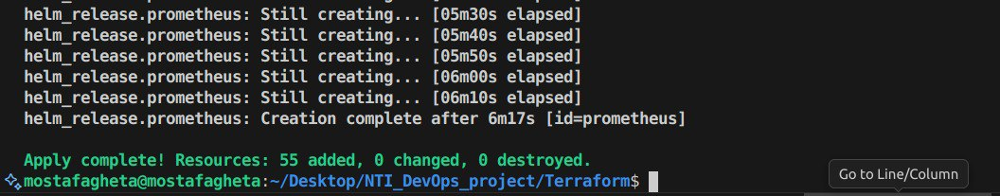
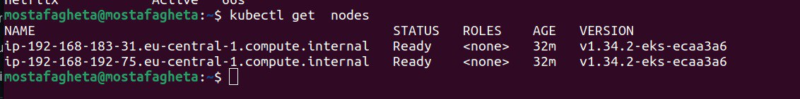

  

<h1 align="center">
  
</h1>

<h3 align="center">
Ìæì DevOps Graduation Project ‚Äî <strong>National Telecommunication Institute (NTI)</strong>
</h3>

---

## Ì∫Ä Project Overview

This project demonstrates a **production-grade End-to-End DevSecOps + GitOps pipeline**
for a Netflix-like application deployed on **AWS EKS**.

The solution integrates CI/CD automation, security scanning, GitOps delivery,
auto-scaling, and full observability.

---

## Ì≥ê Architecture Overview

  

---

## ÌøóÔ∏è Step 1: Infrastructure Provisioning (Terraform)

\`\`\`bash
cd terraform
terraform init
terraform plan
terraform apply -auto-approve
\`\`\`

### ÌæØ What Gets Created

- VPC with public & private subnets
- Internet Gateway & NAT Gateway
- EKS cluster with managed node groups
- IAM roles & security groups
- ALB Ingress infrastructure

  

---

## ⚙️ Step 2: Configure kubectl for EKS

\`\`\`bash
aws eks update-kubeconfig --name my-eks --region eu-central-1
kubectl get nodes
kubectl get ns -A
\`\`\`

  

  

---

## Ì∞≥ Step 3: Build Docker Image Locally

\`\`\`bash
docker build -t netflix-clone:local .
docker run -d -p 8080:80 netflix-clone:local
curl http://localhost:8080
\`\`\`

---

## Ì≥¶ Step 4: Push Image to Amazon ECR

\`\`\`bash
aws ecr get-login-password --region eu-central-1 \
  | docker login --username AWS --password-stdin 734468801857.dkr.ecr.eu-central-1.amazonaws.com

docker tag netflix-clone:local \
  734468801857.dkr.ecr.eu-central-1.amazonaws.com/nti_project:latest

docker push 734468801857.dkr.ecr.eu-central-1.amazonaws.com/nti_project:latest
\`\`\`

  

  

---

## Ì¥Ñ Step 5: CI/CD + GitOps Automation

Once the image exists in Amazon ECR, the pipeline automatically performs:

**Scan ‚Üí Tag ‚Üí Push ‚Üí Update Manifest ‚Üí ArgoCD Sync ‚Üí Deploy**

---

## Ì¥Ñ Step 6: Install & Configure ArgoCD

\`\`\`bash
kubectl create namespace argocd
kubectl apply -n argocd \
  -f https://raw.githubusercontent.com/argoproj/argo-cd/stable/manifests/install.yaml
kubectl port-forward svc/argocd-server -n argocd 8080:443
\`\`\`

  

---

## Ì≥¶ Step 7: Create ArgoCD Application

\`\`\`bash
kubectl apply -f argocd/application.yaml
\`\`\`

ArgoCD continuously watches the Git repository and synchronizes changes automatically.

---

## Ì¥Ñ Step 8: Trigger Auto Deployment

\`\`\`bash
echo "trigger pipeline" >> README.md
git add README.md
git commit -m "chore: trigger deployment"
git push origin main
\`\`\`

**CI ‚Üí Scan ‚Üí Push to ECR ‚Üí Update Manifest ‚Üí ArgoCD Sync ‚Üí Deploy**

---

## Ì≥ä Step 9: Verify Deployment

\`\`\`bash
kubectl get all -n netflix
kubectl get hpa -n netflix
\`\`\`

  

---

## Ì∫Ä Step 10: Verify Cluster Autoscaler

\`\`\`bash
kubectl get all -A | grep cluster-autoscaler
\`\`\`

  

---

## Ì¥ë Step 11: Verify External Secrets

\`\`\`bash
kubectl get all -n external-secrets
\`\`\`

  

---

## Ì¥ê Step 12: TLS Certificate (ACM)

  

---

## ̺ê Step 13: Application Running

  

---

## Ì≥ä Project Outcomes

- End-to-End DevSecOps & GitOps pipeline
- Secure image lifecycle using Amazon ECR
- Automated CI/CD using GitHub Actions
- GitOps-based deployment with ArgoCD
- Auto-scaling with HPA & Cluster Autoscaler
- Full observability and monitoring

---

## Ì¥ù Acknowledgments

**National Telecommunication Institute (NTI)**  
For professional DevOps training and cloud-native guidance.

---

⭐ **Star this repository if you found it helpful!**

**Sohila Hosam**  
GitHub: https://github.com/sohila12

